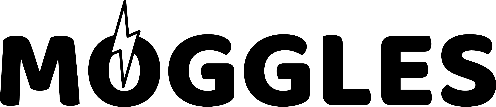

#   

Feature flag management for non development wizards.  

Web application that centralizes feature flags across all applications in an enterprise. Feature flag management application for developers, BAs and everyone involved in the software development lifecycle process.

Developed together with [MogglesClient](https://github.com/NSIAppDev/MogglesClient). 

1. [Technologies used](#technologies-used)
2. [Features](#features)
3. [Setup](#setup)
4. [License](#license)

## Technologies used  
.NET Core, Microsoft SQL Server, Vue.js, ...  
To be added.

## Features

* **Add application.** -> [Go to screenshot](./MogglesImages/AddApplication.PNG)
* **Add environment.** -> [Go to screenshot](./MogglesImages/AddEnv.PNG)  
  * The environment is added to a specific application.
  * A default feature toggle value for the environment can be set.
* **Add feature flag.** -> [Go to screenshot](./MogglesImages/AddFeatureToggle.PNG)  
  * The feature flag is added to a specific application in all environments.
* **Turn on/off feature flags on different environments, edit notes and set feature as accepted by the client.** -> [Go to screenshot](./MogglesImages/EditFeatureToggle.PNG)

:heavy_exclamation_mark: *In order to make use of the following features a [Rabbitmq](https://www.rabbitmq.com/configure.html) machine will need to be setup and ```UseMessaging``` key will need to be set in the application configuration file.*

* **Force cache refresh.** -> [Go to screenshot](./MogglesImages/ForceCache.PNG)
  * If the impact of a toggle needs to be immediate, a force cache message can be published by the application. [MogglesClient](https://github.com/NSIAppDev/MogglesClient) will read the message from the queue and it will refresh the cache for the corresponding application. The published message contract can be found [here](./MogglesContracts/RefreshTogglesCache.cs).
* **Show deployed feature toggles.** -> [Go to screenshot](./MogglesImages/ShowDeployedToggles.PNG)  
  * For each environment the application will show the deployed feature toggles such that the team knows when the code was published on each environment.
  * The queue name for this event will need to be provided.
  * The consumer implemented in Moggles will read the message from the queue (published by [MogglesClient](https://github.com/NSIAppDev/MogglesClient)) and it will update the status of each feature toggle. The expected message contract can be found [here](./MogglesContracts/RegisteredTogglesUpdate.cs).

## Setup  
#### **Configuration keys**   
 * Database connection string  
   The application uses a Microsoft SQL Server database created with the Code First approach.
   ```C#
   "ConnectionStrings": {
      "FeatureTogglesConnection": "Server=ServerName;Database=Moggles;Integrated Security=true;Application Name=Moggles"
   }
   ```  
 * Messaging
   ```C#
   "Messaging": {
      "UseMessaging": "true",
      "Url": "rabbitmq://messageBusUrl",
      "Username": "user",
      "Password": "password",
      "QueueName": "moggles_deploy_status_queue"
   }
   ```
   If ```UseMessaging``` is set to false the messaging features will not be available.

 * Application insights instrumentation key  
   ```C#
   "ApplicationInsights": {
      "InstrumentationKey": "instrumentation key"
    }
   ```  
 * Custom roles  
   The application uses role based authorization. This part can be removed by removing the ```ConfigureAuthServices``` method from ```Startup``` and the authorize policy from the ```HomeController```. 
   ```C#
   "CustomRoles": {
      "Admins": "adminsGroup"
   }
   ```
   
  
## License
The project is licensed under the [GNU Affero General Public License v3.0](./LICENSE) 
